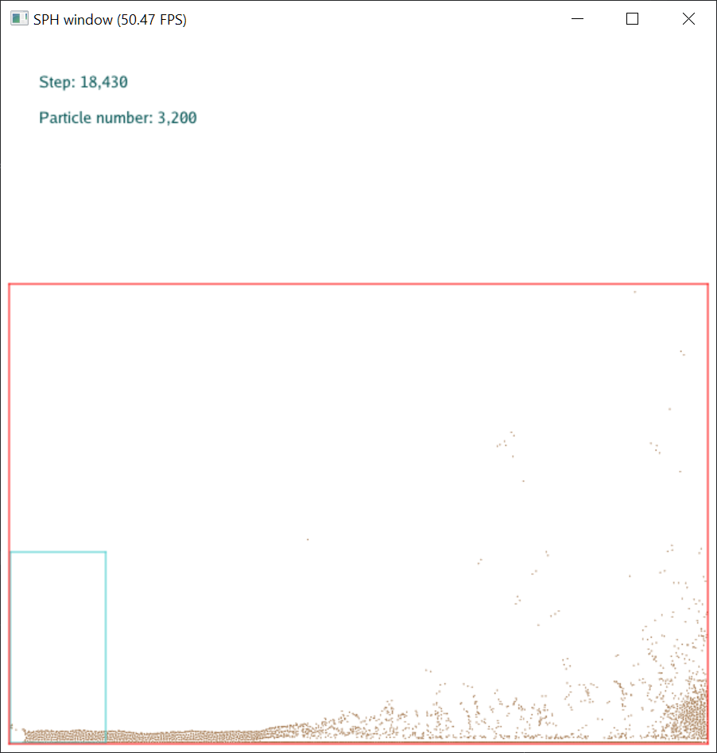
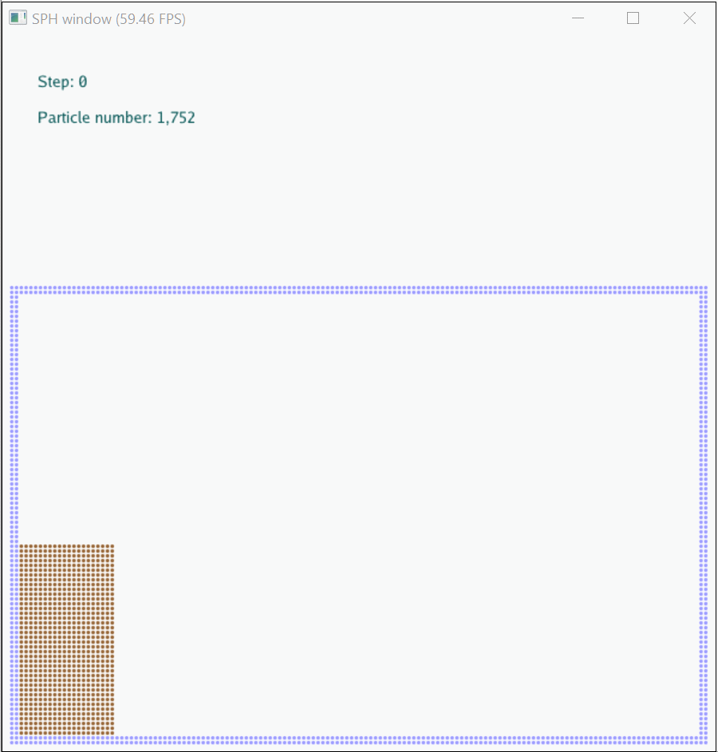

22.07.23.
1. After checking the dBA function, eliminate the warning of f32 -> i32. but still not a good function of calculate dB/dA
2. Draw the iparticle as red!
3. Something bad will happen when coh == 0?
4. Need a low precision of fDP!!!??? Why taichi cannot keep the value unchanged while calculating? Such as taichi will transfer *-1392.923706* to *-1392.923706054688*??? It is really annoying! In python, this will not happen!!!

22.07.05.
1. The stress in muI, which is for positive compoment? tensile or compressive? Notice that compressive should be positive in geotechnic while negative in other areas. And now in muI, stress is negative.

22.07.01.
1. Post a question in [taichi forum](https://forum.taichi.graphics/t/wcsph-accessing-field/2704)

22.06.19.
1. Finally be clear of the support domain radius $\kappa h$ and smoothing length $h$!

22.06.15.
1. the explode problem might be caused by the wrong kernel value!

22.05.10.
1. Rocky can do simulations with over 1MM particles in one gaming card!
2. SPlisHSPlasH takes around 0.5kb memory per particle
3. QuanTaichi can shrink the memory size per particle to 40b!
4. How much particles can I use in a 4GB GPU memory or a 16GB CPU memory?

22.04.12.
1. To change the location of padding, I need to change the whole coordinate system of real physical world, simulation world and drawing world.
   1. For real world, the origin is the d-l corner.
   2. For calculation world, it is the expansion of real world and the origin keeps at the d-l corner of real world.
   3. For drawing world, the key issue is the screen-world-ratio and the origin being at the d-l corner of screen.
   4. Learn from fem128ggui to see how to change the color of particles as value changes when simulating.
2. To implement the constitutive model, the $\nabla u$ is a necessary variable. But maybe it cannot be calculated directly through the SPH derivative equation. **How can one equation of the gradient of a vector lead to a vector result of four vector?**
* TODO: Unify all coordinate systems and put padding area outside the real world.

22.03.31.
1. Reread the basi knowledge and make a **new plan** for code:
   1. Conduct a simple shear test, Bui2021 Section 3.2.4.
   2. Conduct a granular column collapse test, Bui2021 Section 3.3.

22.03.14.
1. Reread my codes and prepare to start again.

22.01.07.
1. After retest, for water column with 20000 particles, RK4 is about 7 FPS and Symp Euler is about 14 FPS, not very slow.

22.01.03.
1. Fail to implement SOILSPH on time!!!!!! :sob::sob::sob::sob::sob::sob::sob::sob: Mainly because of the lack of understanding of the constitutive model of soil
2. Try to update the original WCSPH with new boundary treatment and RK4 method.
3. Have some problems of wcsph!!!!! 22.01.03.02:48
4. **FIND** that the size of simulation is very relative to the result!!!!! For example the water column, 150-15-1.5 with particle radius 0.1-0.01-0.001 will cause absolutly different result! **WHY**
5. After adding the repulsive particles, the bottom and left grids again start to eat particels!!!!!:sob:

22.01.02.
1. Add test2.py as the test for calculation of dA and dB in boundary treatment.
2. Why the boundary enforcement doesn't work for soil particles?

21.12.21.
1. Sometimes the grid(1, 1) will eat particles! (before add boundary particles)

2. But after just adding boundary particles, particles will be eaten in the grid(:, 1)!!!!!!!!! Amazing!!!

------ After considering the $\rho$ of boundary particles, this has been solved, maybe.
[running with boundary particles](temp/211221_show1.mp4)
3. Still **DO NOT** konw if the collisions solver and boundary particles both should exist at the same time.

21.12.20.
1. The sum of m_V of all particles DONOT equal to the area of cube!!!

21.12.17.

1. When the **particle radius > 0.05**, internal error occured:

Exception has occurred: RuntimeError
[llvm_program.cpp:taichi::lang::LlvmProgramImpl::check_runtime_error@436] Assertion failure: (kernel=allocate_particles_to_grid_c20_0) Accessing field (S16place<i32>) of size (256, 256) with indices (-2147483648, -2147483648)
  File "D:\ZLei\Documents\Git\taichiCourse01_tiSPHi\eng\particle_system.py", line 248, in initialize_particle_system
    self.allocate_particles_to_grid()
  File "D:\ZLei\Documents\Git\taichiCourse01_tiSPHi\eng\sph_solver.py", line 122, in step
    self.ps.initialize_particle_system()
  File "D:\ZLei\Documents\Git\taichiCourse01_tiSPHi\test1.py", line 29, in <module>
    wcsph_solver.step()

2. In CPU debug mode, if there are no breakpoints before wcsph solver para, a sentence will occur in the terminal:
IMAGE_REL_AMD64_ADDR32NB relocation requires anordered section layout.
