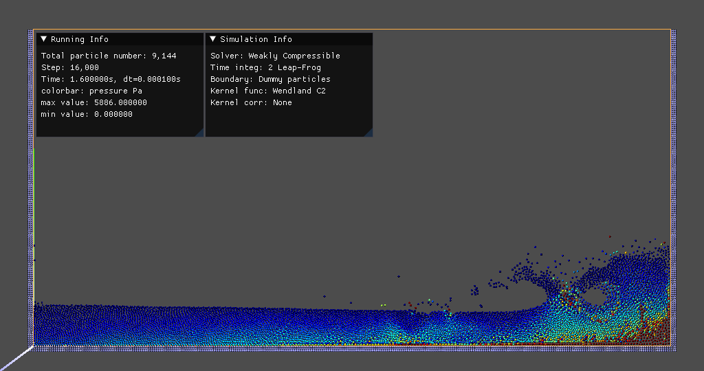
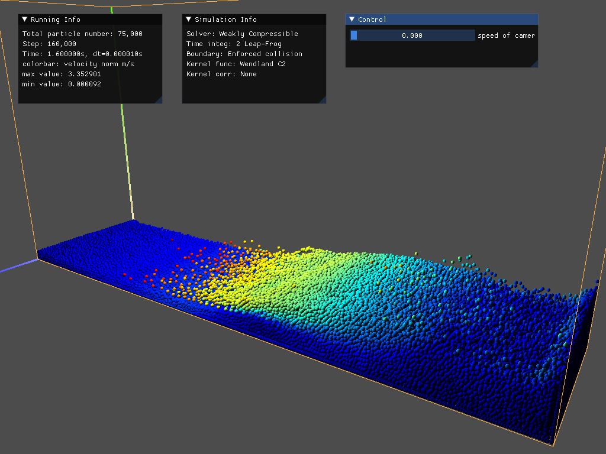
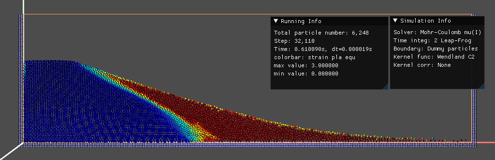
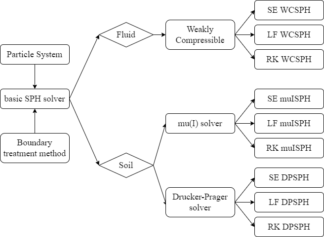

# tiSPHi

<div align="center">
  
</div>

An accurate, stable, fast, extendable fluid-solid coupling SPH solver

## News

**06 Feb. 2023** - Still problems in all simulations!

## Demos

### Water dambreak

<div align="center">
  
</div>

<div align="center">
  
</div>

Fig. Water dambreak at 1.6s, 2D colored by pressure and 3D colored by velocity (very slow and wrong of 3D).

### Granular column collapse

<div align="center">
  
</div>

Fig. Granular column collapse at 0.61s (under μ(I) model), 2D colored by accumulated equivalent total strain. You could find pairing instability problem in the left-bottom side.


## Runtime

### Run

1. Creat or change a `.\data\scenes\***.json`, through which you can design a simulation case.
2. run `python run_simulation.py --scene_file .\data\scenes\test1_db_water.json`.

### Hot key

* `SPACE`: control the pause/run of simulation.
* `ESC`: stop and exit the simulation.
* `P`: make a screenshot and save to the folder "screenshots".
* `V`: restore the initiate view.
* Press `Q`, `E` to move `down` and `up` the camera, press `W`, `A`, `S`, `D` to move `forward`, `left`, `back`, `right` the camera.
* Move the slider in `Control panel` to control the moving speed of camera (lcoked when equals to zero) or change the drawing radius of particles.

### Scene file

* Configuration

```json
    "Configuration":
    {
        "GPUmemoryPercent": 0.25,			// percentage of GPU memory used in CUDA backend
        "is2D": true,						// `true` means the simulation is 2d. `false` means 3d
        "domainStart": [0.0, 0.0, 0.0],		// the left-down-backward corner of the domain
        "domainEnd": [3.22, 1.6, 0.5],		// the right-up-forward corner of the domain
        "gravitation": [0.0, -9.81, 0.0],	// vector to define the gravitational acceleration
        "particleRadius": 0.005,			// the radius of the particles in the simulation (all have the same radius)
        "kappa": 2.0,						// smoothing length multiplier
        "kh": 1.5,							// supporting radius multiplier

        "simulationMethod": 1,				// 1: WCSPH, 2: µ(I)SPH, 3: DPSPH
        "timeStepSizeMin": 1e-4,			// the initial (and minimum) time step size used for the time integration
        "boundary": 2,						// 0: No boundary, 1: enforced collision bdy, 2: dummy particle bdy, 3: repulsive particle bdy, 4: repulsive+dummy particle bdy (CD-SBT)
        "kernel": 1,						// 0: cubic-spline kernel, 1: Wendland C2 kernel
        "kernelCorrection": 0,				// 0: no kernel gradient correction, 1: CSPM correction
        "timeIntegration": 2,				// 1: 1st order Symplectic Euler (SE), 2: 2nd order Leap-Frog (LF), 4: 4th order Runge-Kutta (RK)
        "xsph": false,						// `true` means using XSPH method to update the position

        "colorTitle": 7,					// colored variable, see `eng/ui_sim.py`
		"colorGroup": 0,					// colored particle group, 0: flow, 1: flow and rigid, 2: flow, rigid and bdy
		"comment": "sd, Fd",				// comment shown in GUI
        "stepsPerRenderUpdate": 10,			// number of simulation steps per rendered frame
        "pauseAtStart": true,				// `true` means pause simulation at beginning
        "stopEveryStep": 8000,				// pause simulation at every given step value
        "stopAtStep": 0,					// stop simulation at given step
        "exitAtStep": 0,					// exit simulation at given step and make a screenshot
        "stopAtTime": 0,					// stop at given time
        "exitAtTime": 2.4,					// exit at given time and make a screenshot
        "showBdyPts": true,					// `true` means show the bdy particles (both dummy and repulsive particles)
        "kradius": 1.15,					// drawing radius multiplier
        "givenMax": 5886,					// maximum value in drawing (`-1` means not set)
        "givenMin": -1,						// minimum value in drawing (`-1` means not set)
        "fixMax": 1,						// `1` (true) means set the maximum value as constant, otherwise it will change until the real value is bigger than `givenMax`
        "fixMin": 0,						// `1` (true) means set the minimum value as constant, otherwise it will change until the real value is smaller than `givenMin`

		"exportEveryTime": 0.001,
		"exportEveryRender": 0,				// save frame in specific steps. `5` means every `5 × stepsPerRenderUpdate` step will be saved in a new folder
		"exportFrame": false,				// save png files
		"exportVTK": false,					// save vtu files
		"exportCSV": false					// save csv files
    },
```

* Materials

```json
    "Materials": [
        {
            "matId": 0,						// id of the current material
            "matType": 1,					// 1: water or fluid
            "color": [50, 100, 200],		// default drawing color
            "density0": 1000,				// rest density, kg/m3
            "viscosity": 0.005,				// coefficient for the viscosity force computation
            "stiffness": 50000,				// stiffness coefficient of the equation of state
            "exponent": 7					// exponent in the equation of state
        },
        {
            "matId": 1,
            "matType": 2,					// 2: sand or granular material
            "color": [180, 100, 24],
            "density0": 2040,
            "cohesion": 0,					// cosition, Pa
            "friction": 21.9,				// friction, DEG
            "EYoungMod": 5.84e6,			// Young's modulus, Pa
            "poison": 0.3,					// Poison ratio
            "dilatancy": 0					// dilatancy angle, DEG
        }
    ],
```

* Blocks

```json
    "FluidBlocks": [
        {
            "objectId": 0,					// id of the current object
            "size": [1.2, 0.6, 0.2],		// cube size in x, y, z direction
            "translation": [0, 0, 0],		// cube left-down-backward coner position
            "velocity": [0.0, 0.0, 0.0],	// the initial velocity is set for all particles in the fluid model
            "materialId": 0					// the material id of current object
        }
    ]
```


## Ambition


