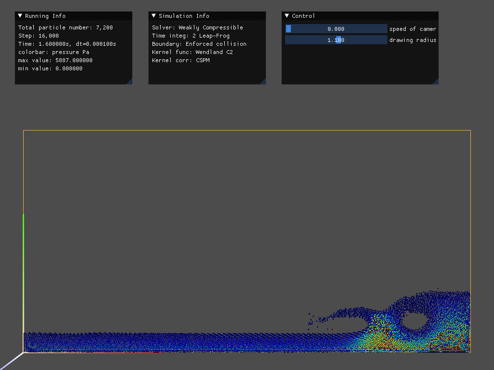

# tiSPHi

  

An accurate, stable, fast, extendable fluid-solid coupling SPH solver

## News

**07 Dec. 2022** - SORRY BUT ONLY WATER DAMBREAK CAN RUN NOW!

## Demos

  

  

Fig. Water dambreak at 1.6s, 2D colored by pressure and 3D colored by velocity

## Runtime

### Run

1. Creat or change a `.\data\scenes\***.json`, through which you can design a simulation case.
2. run `python run_simulation.py`.

### Hot key

* `SPACE`: control the pause/run of simulation.
* `ESC`: stop and exit the simulation.
* `P`: make a screenshot and save to the folder "screenshots".
* `V`: restore the initiate view.
* Press `Q`, `E` to move `down` and `up` the camera, press `W`, `A`, `S`, `D` to move `forward`, `left`, `back`, `right` the camera.
* Move the slider in `Control panel` to control the moving speed of camera (lcoked when equals to zero) or change the drawing radius of particles.

## Ambition

