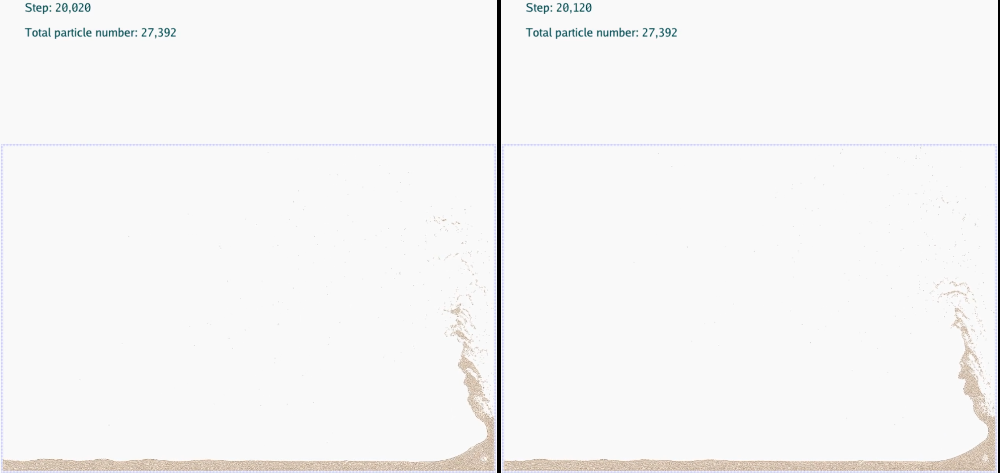
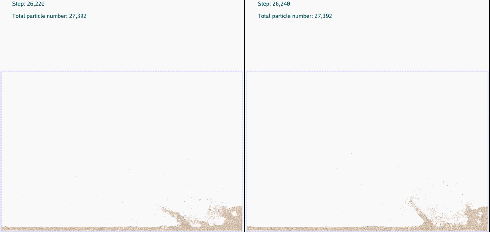
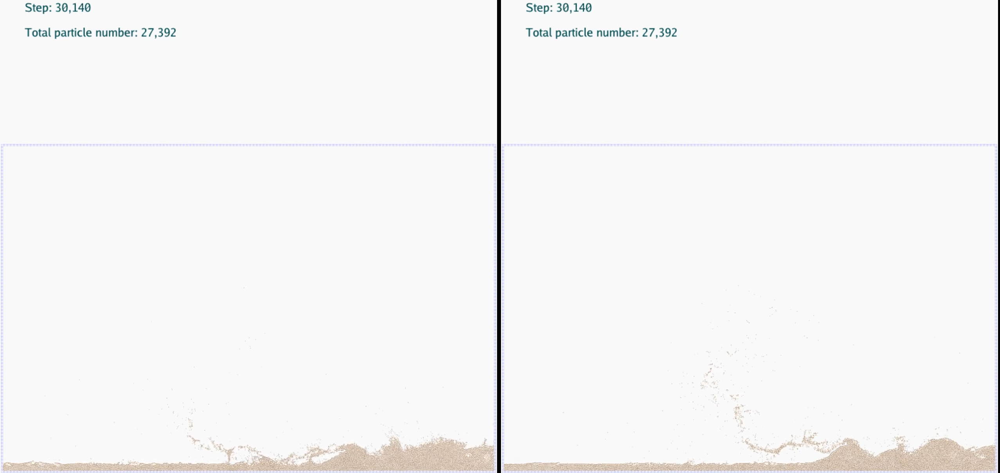
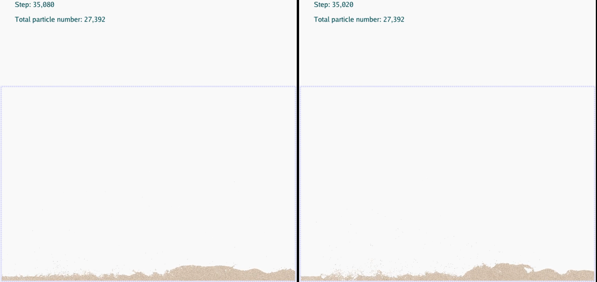
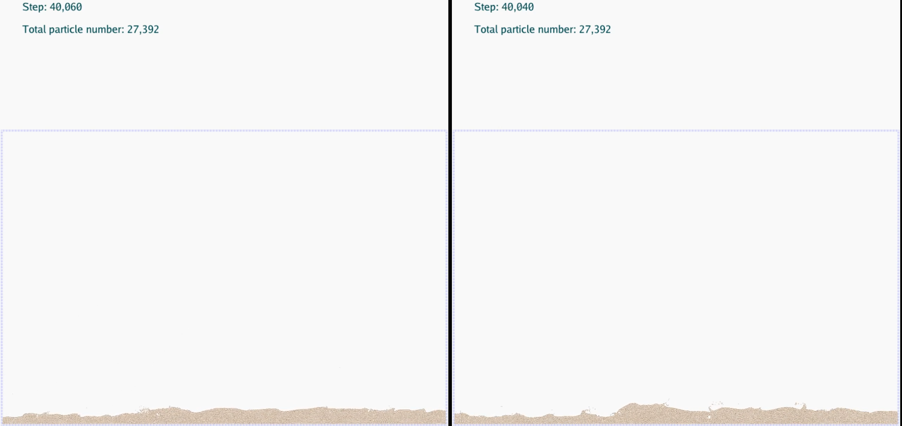
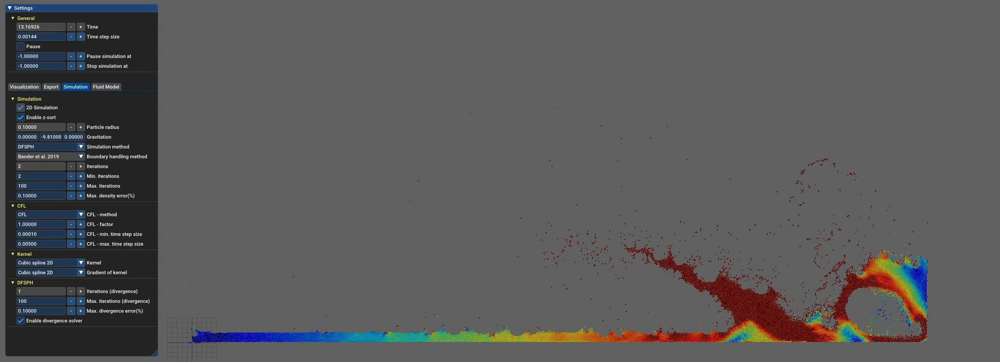

# 太极图形课S1-tiSPHi: from 0 to 0.1
<div align="center">
  
</div>

## 背景简介

源自我的研究学习任务，希冀能通过taichi熟悉并实现泥石流的SPH模拟过程。
伟大的目标：实现3D-SPH-FEM耦合的泥石流模拟！
首先实现SPH求解器，基于土壤的D-P本构模型，模拟简单的sand-column，然后是mud-flow，最后是debris-flow。
小目标：通过WCSPH学习代码思路，基于WCSPH框架实现Standard SOILSPH。

> The logo is modified from a basic SPH logo by MichellLaurence on [DeviantArt](http://michelllaurence.deviantart.com/art/sph-logo-139673758)

> **HINT**
> 然而发现小目标的实现也很困难……
> 两个星期的学习，tiSPHi from 0 to 0.1 and just 0.1
> :satisfied:Know almost nothing of SPH → :satisfied:Learn basic SPH theory → :sweat_smile:Learn basic WCSPH codes → :grin:First try: adding dummy particles → :confused:Learn standard SPH theory for soil → :persevere:Try to implement SOILSPH code → :disappointed:**Failed** to understand D-P criterion for soil and also cannot implement it in SPH → :sob:**Failed** to adapt the stress and other paras of soil → :sob:**Failed** to add repulsive forces in repulsive particles, so cannot delete the collision code in `SPHBASE` → :sob:**Failed** to finally use RK4 to advect soil particles → :disappointed:Return to add repulsive forces in WCSPH to delete the collision code but again **Failed** → :smile:Try to use RK4 to update particles instead of Symp Euler method, and finally **succeed** → :scream:It comes to the deadline
> 挺打击信心的，但更可能是之前太高估自己了。只能暂时提交一个仍旧是水的大作业了，悲痛欲绝。
> 但是，好久没有这么酣畅淋漓（抓耳挠腮）地写过代码了！
> 暂时休息，还有很久的时间发展我的tiSPHi！


## 作业来源
### 灵感来源
实现未来的课题！

### 代码
1. [taichiCoourse01, wcsph code by Mingrui Zhang](https://github.com/erizmr/SPH_Taichi)
2. [Stress Particle SPH (用的是不太会的Fortran)](https://github.com/CaitlinChalk/Stress-Particle-SPH)
3. [SPlisHSPlasH](https://github.com/InteractiveComputerGraphics/SPlisHSPlasH)

### 文献
1. 待复现的目标文献 (CM Chalk 2020): [Stress-Particle Smoothed Particle Hydrodynamics: An application to the failure and post-failure behaviour of slopes](https://doi.org/10.1016/j.cma.2020.113034)
2. CM Chalk的博士论文2019(包含在Stress Particle SPH的GitHub内)
3. Ha H Bui 2021: [Smoothed particle hydrodynamics (SPH) and its applications in geomechanics: From solid fracture to granular behaviour and multiphase flows in porous media](https://doi.org/10.1016/j.compgeo.2021.104315)
4. Ha H Bui 2008: [Lagrangian meshfree particles method (SPH) for large deformation and failure flows of geomaterial using elastic-plastic soil constitutive model](https://doi.org/10.1002/nag.688)

## 运行方式
### 运行环境：
`[Taichi] version 0.8.1, llvm 10.0.0, commit cc2dd342, win, python 3.8.1`
`[Taichi] Starting on arch=cuda`

### 运行方式
修改`draft2_water.py`中的参数即可运行模拟自由释放水柱(默认位于容器左下角)的WCSPH。
1. `world`: 容器的物理边界尺寸，单位m
2. `particle_radius`: 物质点粒子半径
3. `kh`: 支持域半径对物质点粒子半径的倍数
4. `cube_size`: 水柱的宽度与高度
5. `flag_pause`: 模拟开始时的暂停状态
6. `add_cube`函数中可调整初始速度、初始压力、密度、颜色等属性

### 快捷键
1. `SPACE`控制模拟的开始/暂停
2. `ESC`停止并退出模拟

## 效果展示
### my WCSPH
Advect with Symplectic Euler
[Video of WCSPH with Symp Euler](./data/20220103_160035_SEuler_wcsph.mp4)

Advect with RK4
[Video of WCSPH with RK4](./data/20220103_153121_RK4_wcsph.mp4)

Compare the specific frames of these two result: (RK4 on the left and Symp Euler on the right)






(I think the RK4 advection represents a better result, :smile: **BUT** really it is very very very very very slow!!!)

### SPlisHSPlasH
WCSPH in SPlisHSPlasH (also I think my wcsph simulation looks better than that in SPlisHSPlasH)
[Video of WCSPH in SPlisHSPlasH](./data/20220103_141306_SPlisHSPlasH_wcsph.mp4)


DFSPH in SPlisHSPlasH (but still not as good as DFSPH)
[Video of DFSPH in SPlisHSPlasH](./data/20220103_141559_SPlisHSPlasH_dfsph.mp4)



## 整体结构
```
-LICENSE
-|data   --存放动图、视频等数据
-|eng    --存放engine代码
---__init__.py
---particle_system.py
---sph_solver.py
---wcsph.py
---soilsph.py
-|img    --存放图片
-|temp   --存放测试代码、学习资料、算法流程图、草稿、临时文件等
-README.MD
-draft0.py        --最初的测试代码，无用
-draft1_soil.py   --测试SOILSPH使用的代码，目前尚未完成且存在错误
-draft2_water.py  --测试更新后WCSPH使用的代码，目前尚可正常运行
-Hint.py          --记录编程过程中的一些烦恼以及锻炼英语
-note_SPH.md      --学习笔记
```

## 实现细节：
> 请给出代码的具体实现流程和细节，让感兴趣的人能够更深入的了解你的代码。

以taichiCourse中的wcsph代码框架，加入了一些自己的改进(Maybe可以说是改进)，具体的实现细节详见[笔记](./note_SPH.md)：
1. 在`ParticleSystem`中加入了边界`dummy particles`的生成(基于`add_cube`函数)
2. 在`SPHSolver`中加入了速度等重要信息最大值的每一步的输出，用于检查
3. 在`WCSPHSolver`中加入了文献中的边界处理方法，即在对每一个流体粒子`i`的循环过程中，处理`i`的支持域中存在的`dummy particles`
4. 在`WCSPHSolver`中实现了RK4时间积分方法(尽管它巨慢无比，尚未知为什么4倍的计算量导致计算速度降低至少20倍)
